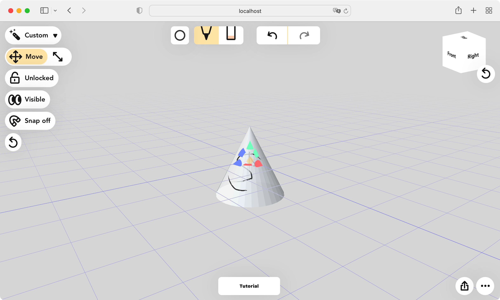

# Penzil


Penzil is a web application for sketching in 3d, powered by three.js and Vue. It is intended to be a light version of Blender's Grease pencil for the web. Penzil is designed for tablet with a pen, but it should work on desktop as well.

See the [Roadmap](https://github.com/jacopocolo/Penzil/projects/1) for upcoming features. 

## Basic instructions

- You can draw/erase with left mouse button, finger or pen on top of the "3d canvas", the white plane in the 3d scene.
- You can adjust the position of the "3d canvas" with the arrow-heads or the arcs at the center.
- You can move and rotate the camera using the touchpad, two fingers or by pressing the alt key and dragging with the left mouse button. Panning is done with three fingers or by pressing the Spacebar and dragging with the left mouse button.
- You can swap your primary tool between pencil and eraser from the selector at the top.

## Saving, loading and exporting

- Penzil is a fully local application. No servers are involved. Because of the size of the files (and, partially, scope) saving and loading is currently done manually. You can save a .json file with your drawing and restore it with Load. Big files will take a long time to load as the geometries are not optimized yet.
- Penzil exports in a format friendly to Blender's grease pencil but an importer is necessary. The importer doesn't exist yet but I have a Python script that can be run from Blender. If you want to import into Blender, join the Penzil Discord server. You can find the link in the app.


## How to run Penzil.app locally

- First install ``yarn``
  - For MacOS:
    ```
    brew install yarn
    ```
  - For other OS:
    Check the [official doc](https://classic.yarnpkg.com/lang/en/docs/install/#mac-stable)
- Clone [camera-controls](https://github.com/jacopocolo/camera-controls) repo to the parent dir of Penzil, and run ``yarn add ../camera-controls/``
 
- Then at the root folder of this project, run the commands below to install dependencies.
    ```
    yarn install 
    ```
- After installation finishes, run:
  ```
  yarn run serve
  ```
  Then in your browser go to http://localhost:8080/ to see the app.

# How to add custom mesh as canvas
- Simply rename your mesh glb file as "custom.glb" and put it in the "{project_root}/public/" folder, and you are all set. 
  